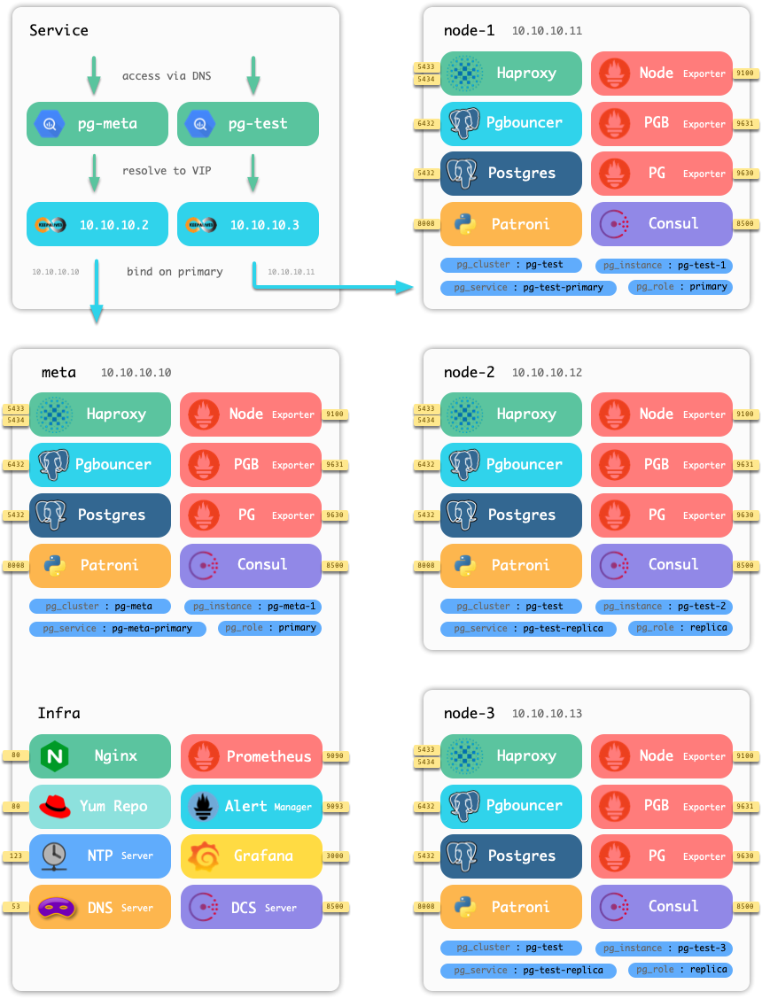

## Architecture

Pigsty is based on open source projects like [prometheus](https://prometheus.io/), [grafana](https://grafana.com/),  [`pg_exporter`](https://github.com/Vonng/pg_exporter) and follow their best practices.

### TL;DR

* Grafana provides the final user interface, turn metrics into charts.
* Prometheus scrape, collect metrics and serve queries
* Exporter (node, postgres, pgbouncer, haproxy) expose server metrics
* Exporter service are registed into consul, and be discovered by prometheus

* Read more about [`pg_exporter`](https://github.com/Vonng/pg_exporter)

* Available metrics

