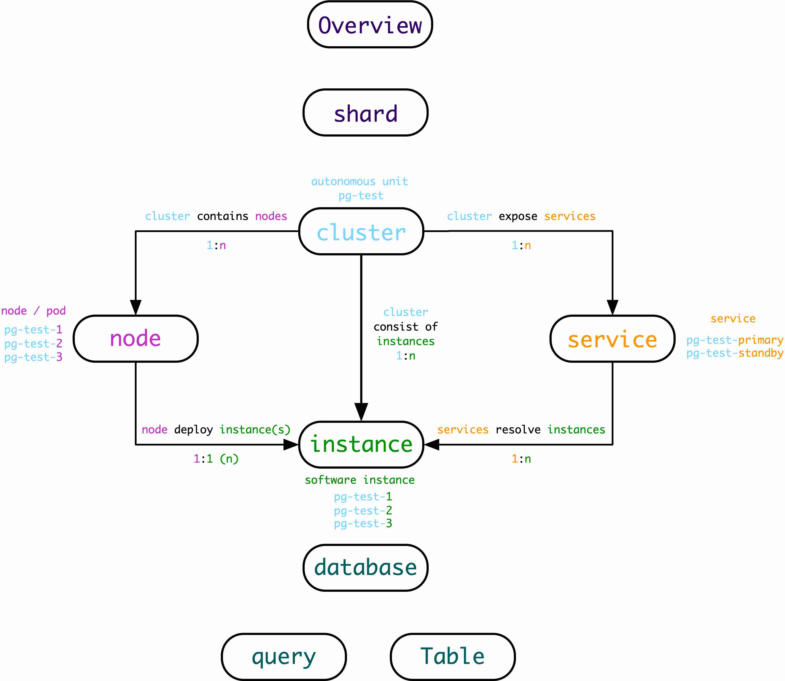

## Hierarchy

There are several different levels for monitoring: 

* **Overview**: Global views about all instances and clusters among current environment.
* Shard: A brunch of clusters that are horizontal split to serve same business 
* **Cluster**: Basic autonomous unit. Have a designated name (such as `pg-test-tt`) that reflect business, and used as namespace. which usually consist of multiple database instances, contains multiple nodes, and two typical serivce: `<cluster>-primary` (read-write) and `<cluster>-replica` (read-only).
* **Service**: Service is an abstraction on addressible server 
* **Instance**: A specific database server, could be single process, a brunch of processes, or multiple containers in a pod. 
* **Database**: A database instance/cluster may have one or more database
* **Table/Query** : In-Database object monitoring

**Basic Facts**

* Cluster is the minimal autonomous unit
* Cluster contain nodes (1:n)
* Cluster include services (1:2)
* Cluster consist of instances (1:n)
* Service resolve/route to instance (1:n)
* Instances deployed on nodes (1:1 or n:1) 

